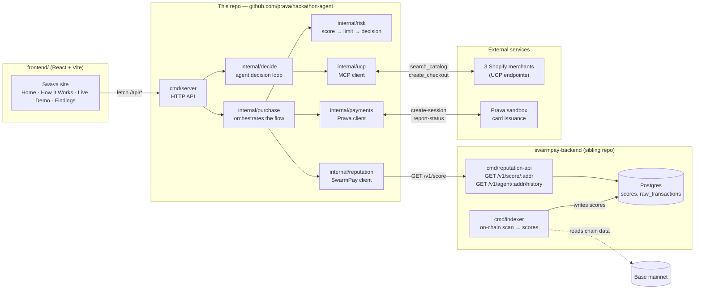
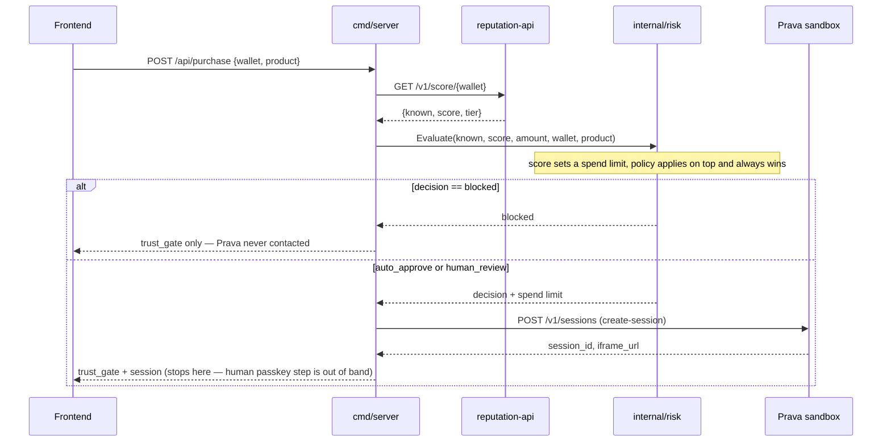

# Swava — an AI Procurement Manager for agent-initiated payments

Swava lets a company give an AI agent real spending power without letting it
spend unsupervised. Every purchase an agent tries to make is checked against
the agent's own on-chain trust score and a company-configured procurement
policy — auto-approved, sent for manager review, or blocked outright — before
any payment provider is ever contacted.

This repo is the hackathon build: a working agent decision loop, a real
reputation-based trust gate, a real sandbox payment integration, and the
[Swava frontend](frontend/) that demos all of it live. The reputation index
and scoring engine live in a sibling repo, [`swarmpay-backend`](../swarmpay-backend)
(see [Architecture](#architecture)).

## What's real vs. what's a hackathon shortcut

Real, live, verifiable:
- Merchant search and checkout attempts run against three real Shopify stores
  over the [Universal Commerce Protocol](https://ucp.dev) (UCP) — no mocked
  catalog.
- Wallet trust scores come from a real Postgres-backed reputation index
  (~178,000+ indexed addresses, built before this hackathon).
- Payment sessions are real sandbox sessions issued by
  [Prava](https://docs.prava.space), with a real card token and iframe URL.

Hackathon shortcuts, documented honestly rather than hidden — see
[`frontend`'s Findings page](frontend/src/pages/Findings.tsx) for the full
list:
- The agent can only choose between **three hardcoded products** (see
  [Catalog](#catalog)), not an arbitrary live search result — `internal/purchase`
  only knows how to check out product/variant IDs verified live in advance.
- Completing a sandbox purchase requires a human to open Prava's iframe and
  pass a passkey challenge — there's no server-side path around this, so the
  HTTP API (`cmd/server`) deliberately stops right after issuing the session.
- Merchant trust is not scored. Only the buying agent's wallet is.

## Architecture

Two repos, three moving parts:



**Trust gate flow for one purchase** (`internal/purchase.CreateSandboxSession`,
called from `POST /api/purchase`):



## Repo layout

```
cmd/
  agent/      CLI — tools/list + search_catalog demo across all merchants,
              or (if TASK is set) the live agent decision loop
  pay/        CLI — hardcoded product purchase, full flow through to a
              real checkout attempt and Prava report-status
  server/     HTTP API backing the frontend — thin layer over internal/*,
              no business logic of its own

internal/
  decide/     agent decision loop: search live, pick best in-budget +
              task-relevant match from the known catalog
  purchase/   orchestrates one purchase: trust gate → Prava session →
              (CLI only) human approval → UCP checkout → report-status
  risk/       pure function: score + procurement policy → spend limit → decision
  reputation/ HTTP client for SwarmPay's reputation-api
  payments/   HTTP client for Prava's sandbox API
  ucp/        MCP client for Shopify's Universal Commerce Protocol

frontend/     Swava marketing + live-demo site — see frontend/README.md
```

## Catalog

The agent decision loop (`internal/decide.KnownCatalog`) only ever considers
these three products — real items, confirmed live via `search_catalog` /
`get_product`, each from a different configured merchant:

| Product | Merchant | Price | Search term |
|---|---|---|---|
| Sennheiser HD 600 | Headphone Zone | ₹22,990 | `headphones` |
| Sensi Smart 3 Razor | Bombay Shaving Company | ₹99 | `razor` |
| Radio Backpack - 22L | Mokobara | ₹6,999 | `backpack` |

Given a task and budget, the agent searches all three merchants live, then
picks the cheapest option that's both task-relevant and in budget. If the
task names something specific but that item is over budget, the agent
reports no match rather than silently substituting an unrelated cheaper item.

## Trust gate policy

`internal/risk.Evaluate` (score 0-100 normalized, unknown wallets default to
a neutral 50 — never zero, never an error):

| Score | Spend limit | Decision if amount fits | Decision if over |
|---|---|---|---|
| 70+ | ₹10,000 | auto-approve | manager review |
| 30-69 or unrated | ₹500 | auto-approve | manager review |
| &lt;30 | ₹0 | — | blocked, Prava never contacted |

A per-agent **procurement policy** (`internal/risk.PolicyFor`) applies on top
and always wins — currently one configured example: a ₹2,000 category cap and
a blocked-keyword rule for one demo wallet, enforced the same way a real
company policy would be.

## Running it

Prerequisites: Go 1.26+, Node 18+, and `swarmpay-backend`'s `reputation-api`
running (either locally against Postgres, or pointed at a deployed instance).

```bash
cp .env.example .env
# fill in PRAVA_SECRET_KEY / PRAVA_API_KEY (sandbox creds), SWARMPAY_API_URL

# terminal 1 — reputation API this project depends on
cd ../swarmpay-backend && go run ./cmd/reputation-api

# terminal 2 — this project's HTTP API
go run ./cmd/server

# terminal 3 — frontend
cd frontend && npm install && npm run dev
```

Or run the CLIs directly for a one-shot terminal demo:

```bash
# hardcoded product, full flow including human card approval
PRODUCT_CHOICE=shaving WALLET_ADDRESS=0xaaaa000000000000000000000000000000aaaa go run ./cmd/pay

# agent picks a product live based on task + budget
TASK="buy a cheap razor" BUDGET_RUPEES=500 go run ./cmd/agent
```

See `.env.example` for every variable, including which test wallets land on
which trust-gate decision.

## Deployment

- **Frontend**: static build (`npm run build`), deployed to Vercel. Needs
  `VITE_API_BASE` set to `cmd/server`'s public URL + `/api` at build time.
- **`cmd/server`**: deployed to Railway. Needs `SWARMPAY_API_URL` pointed at
  the deployed `reputation-api`, plus the Prava sandbox credentials. CORS is
  an explicit allowlist (`cmd/server/main.go`'s `allowedOrigins`) — add any
  new frontend origin there before it can call the API.
- **`reputation-api`**: also on Railway, same repo/Dockerfile as
  `swarmpay-backend`'s other two binaries (`facilitator-api`, `indexer`) —
  which one runs is selected by a `SERVICE` environment variable, not a
  separate build. `DATABASE_URL` must point at the Postgres instance that
  actually has the indexed `scores` table, not a fresh/empty one.
